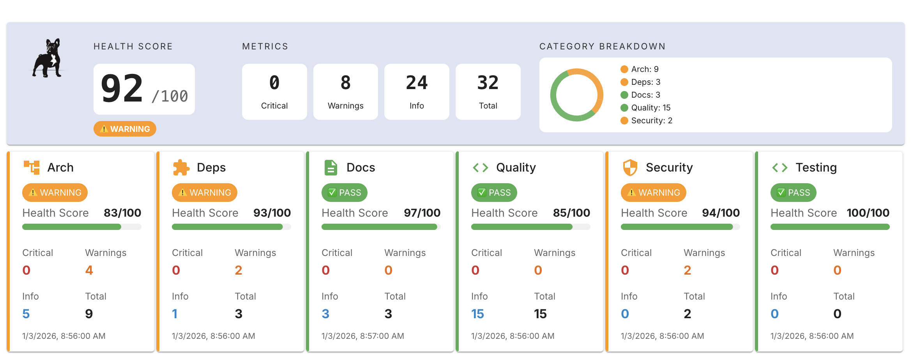
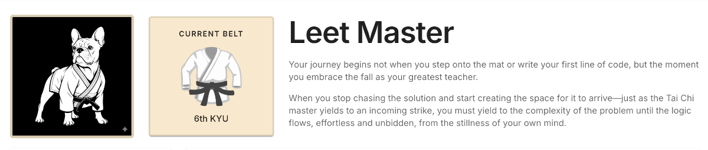

# ZuZu


### ZuZu **is a production-ready full-stack application scaffold that codifies modern best practices for web development, security, and scalable team workflows. It is designed to be a realistic foundation for building, operating, and evolving secure systems in production.**

### Highlights
- **Modern Full-Stack Foundation**
  React + TypeScript frontend (MUI, Redux Toolkit, TanStack Query) with a Node.js / Express backend.
- **Security Built In**
  JWT authentication with httpOnly cookies, CSRF protection, rate limiting, and structured logging by default.
- **Production-Ready Tooling**
  Supabase for data persistence and Cypress for end-to-end testing to support confident iteration.
- **AI-Driven Workflow Automation**
  Embedded AI agent hooks automate architecture review, security checks, and documentation validation directly in the code and commit workflow.
- **Scalable Team Patterns**
  Designed to reduce cognitive load and enable fast, consistent, and governed development across teams.

### Code Health


### Leet Master
AI assited leet code training using Sandpack React powered by CodeSandbox


## Tech Stack

This project integrates the following technologies:

### Frontend
- **React**: A JavaScript library for building user interfaces
- **MUI Components**: React UI framework following Material Design
- **TypeScript**: A typed superset of JavaScript
- **Redux**: State management for React applications
- **Tailwind CSS**: A utility-first CSS framework
- **Webpack**: Module bundler for JavaScript applications
- **TanStack Query**: Data fetching and caching library

### Backend
- **Express**: Web application framework for Node.js

### Database
- **Supabase**: An open-source Firebase alternative

### Testing
- **Cypress**: End-to-end testing framework

## Getting Started

### Prerequisites

- Node.js (version 16.x or higher)
- npm (version 8.x or higher)

### Installation

1. Clone the repository
   ```bash
   git clone https://github.com/yourusername/zuzu.git
   cd zuzu
   ```

2. Install dependencies
   ```bash
   npm install
   ```

3. Set up environment variables

   **Frontend configuration:**
   ```bash
   # Copy the example file
   cp .env.example .env
   ```

   Edit `.env` and add your credentials:
   - `REACT_APP_SUPABASE_URL`: Your Supabase project URL (get from [supabase.com](https://supabase.com))
   - `REACT_APP_SUPABASE_KEY`: Your Supabase anon key
   - `REACT_APP_ZUZU_OPENROUTER_KEY`: Your OpenRouter API key (get from [openrouter.ai/keys](https://openrouter.ai/keys))
   - `REACT_APP_PRODUCTION`: Your production frontend URL (optional, for production deployments)

   **Backend configuration:**
   ```bash
   # Copy the example file
   cp server/.env.example server/.env
   ```

   Edit `server/.env` and add your credentials:
   - `SUPABASE_URL`: Your Supabase project URL
   - `SUPABASE_KEY`: Your Supabase service role key (⚠️ keep this secret!)
   - `ZUZU_OPENROUTER_KEY`: Your OpenRouter API key
   - `PORT`: Server port (default: 5000)
   - `PRODUCTION_FRONTEND_URL`: Your production frontend URL (automatically added to CORS allowed origins)
   - `ALLOWED_ORIGINS`: Additional allowed CORS origins (optional, comma-separated)
   - `JWT_ACCESS_SECRET`: JWT secret for access tokens (generate with `openssl rand -base64 48`)
   - `JWT_REFRESH_SECRET`: JWT secret for refresh tokens (generate with `openssl rand -base64 48`)
   - `CSRF_SECRET`: CSRF token signing key (generate with `openssl rand -base64 48`)

### Running the Application

1. Start the development server (both frontend and backend)
   ```bash
   npm run dev
   ```

   This will start:
   - React frontend at [http://localhost:3000](http://localhost:3000)
   - Express backend at [http://localhost:5000](http://localhost:5000)

2. To run only the frontend
   ```bash
   npm start
   ```

3. To run only the backend
   ```bash
   npm run server
   ```

### Building for Production

```bash
npm run build
```

The build files will be generated in the `dist` directory.

### Running Tests

```bash
# Run tests in headless mode
npm test

# Open Cypress Test Runner
npm run test:open
```

## Security

ZuZu implements multiple security layers to protect against common web vulnerabilities.

### CSRF Protection

The application uses cookie-based authentication with `sameSite: 'none'`, which requires CSRF protection:

- **Implementation**: Double Submit Cookie pattern using `csrf-csrf` library
- **Protected Routes**: All POST, PUT, DELETE, PATCH endpoints
- **Frontend**: CSRF tokens automatically included via `fetchWithCsrf` helper

**Quick Start:**
```bash
# Generate CSRF secret (add to server/.env)
openssl rand -base64 48
```

See [.claude/SECURITY.md](./.claude/SECURITY.md) for complete security documentation.

### Authentication

- **JWT Storage**: httpOnly, secure cookies (protected from XSS)
- **Token Types**: Short-lived access tokens (15min) + refresh tokens (7 days)
- **Password Security**: bcrypt hashing with salt rounds = 12

### Environment Security

**Required secrets** in `server/.env`:
- `CSRF_SECRET` - CSRF token signing key (generate with `openssl rand -base64 48`)
- `JWT_ACCESS_SECRET` - Access token signing key
- `JWT_REFRESH_SECRET` - Refresh token signing key

**Never commit** `.env` or `server/.env` files to version control.

### Security Review

Run automated security checks:
```bash
python3 .claude/hooks/review-agent.py --focus security
```

For detailed security guidance, see:
- [.claude/SECURITY.md](./.claude/SECURITY.md) - Complete security documentation
- [.claude/AUTH_IMPLEMENTATION.md](./.claude/AUTH_IMPLEMENTATION.md) - Authentication implementation details

## Project Structure

```
ZuZu/
├── .claude/                    # Claude Code integration & automated review
│   ├── agents/                 # AI agent configurations (reviewers, architects)
│   ├── hooks/                  # Pre-commit review automation
│   ├── review/                 # Code review checkers & utilities
│   │   ├── checkers/           # Security, quality, architecture, testing validators
│   │   ├── config/             # Review configuration & suppressions
│   │   └── utils/              # Markdown generation, file parsing, fixes
│   ├── SECURITY.md             # Complete security documentation
│   ├── AUTH_IMPLEMENTATION.md  # Authentication implementation guide
│   ├── CLAUDE.md               # Project instructions for Claude
│   └── CODEBASE_REVIEW*.md     # Automated review reports
│
├── src/                        # Frontend React/TypeScript application
│   ├── assets/                 # Static assets (images, fonts)
│   ├── components/             # Reusable UI components
│   │   ├── Header.tsx
│   │   ├── Footer.tsx
│   │   ├── Modal.tsx
│   │   └── ProtectedRoute.tsx
│   ├── pages/                  # Page components (routing targets)
│   │   ├── Home.tsx
│   │   ├── About.tsx
│   │   ├── Dashboard.tsx
│   │   ├── Login.tsx
│   │   ├── Signup.tsx
│   │   ├── Account.tsx
│   │   ├── Logs.tsx
│   │   └── OpenRouter.tsx
│   ├── services/               # API clients & external integrations
│   │   ├── api.ts              # API fetch utilities
│   │   ├── auth.service.ts     # Authentication service
│   │   ├── csrf.service.ts     # CSRF token management
│   │   └── supabase.ts         # Supabase client
│   ├── store/                  # Redux state management
│   │   ├── index.ts            # Store configuration
│   │   └── slices/             # Redux slices (auth, UI)
│   ├── context/                # React Context providers
│   │   └── AuthContext.tsx
│   ├── hooks/                  # Custom React hooks
│   │   └── useQuery.ts
│   ├── types/                  # TypeScript type definitions
│   ├── utils/                  # Utility functions
│   ├── config/                 # Configuration files
│   ├── styles/                 # Global styles & CSS
│   ├── App.tsx                 # Main app component with routing
│   └── index.tsx               # Application entry point
│
├── server/                     # Express backend server
│   ├── routes/                 # API route definitions
│   │   ├── api.ts              # Main API routes
│   │   ├── auth.routes.ts      # Authentication endpoints
│   │   ├── csrf.ts             # CSRF token endpoints
│   │   ├── logs.ts             # Log access endpoints
│   │   ├── openrouter.ts       # OpenRouter proxy
│   │   └── review.ts           # Code review endpoints
│   ├── controllers/            # Request handlers
│   │   └── auth.controller.ts
│   ├── middleware/             # Express middleware
│   │   ├── auth.middleware.ts        # JWT verification
│   │   ├── csrf.middleware.ts        # CSRF protection
│   │   ├── errorHandler.middleware.ts
│   │   ├── rateLimiter.middleware.ts
│   │   └── validation.middleware.ts
│   ├── services/               # Business logic layer
│   │   ├── auth.service.ts     # Authentication logic
│   │   ├── user.service.ts     # User management
│   │   ├── email.service.ts    # Email operations
│   │   └── supabase.ts         # Supabase integration
│   ├── migrations/             # Database migrations
│   ├── utils/                  # Utility functions
│   │   ├── errors.ts
│   │   └── responses.ts
│   ├── config/                 # Server configuration
│   │   └── logger.ts           # log4js configuration
│   ├── index.ts                # Server entry point
│   ├── .env.example            # Backend environment template
│   └── tsconfig.json           # TypeScript config (CommonJS)
│
├── cypress/                    # End-to-end testing
│   ├── e2e/                    # Test specifications
│   ├── fixtures/               # Test data
│   └── support/                # Commands & configuration
│
├── public/                     # Static public assets
├── dist/                       # Production build output
├── logs/                       # Application logs (auto-created)
│
├── webpack.config.cjs          # Webpack bundler configuration
├── tailwind.config.js          # Tailwind CSS configuration
├── tsconfig.json               # TypeScript config (frontend)
├── cypress.config.ts           # Cypress testing configuration
├── package.json                # Project dependencies & scripts
├── .env.example                # Frontend environment template
└── README.md                   # Project documentation
```

### Key Directories Explained

**Frontend (`src/`)**
- Path aliases configured: `@/*` maps to `src/*`
- Provider hierarchy: Redux → TanStack Query → Router → MUI Theme → Auth
- State management: Redux Toolkit + TanStack Query for server state

**Backend (`server/`)**
- RESTful API with Express
- JWT authentication with httpOnly cookies
- CSRF protection on all mutation endpoints
- Rate limiting and request validation
- Structured logging with log4js

**Development Tools (`.claude/`)**
- Automated code review on commits
- Security, quality, architecture, and testing validators
- AI-powered documentation review
- Suppression management for false positives

**Testing (`cypress/`)**
- E2E tests with Cypress
- Configured for component and integration testing
- Test data fixtures and custom commands

## License

This project is licensed under the MIT License - see the LICENSE file for details.
